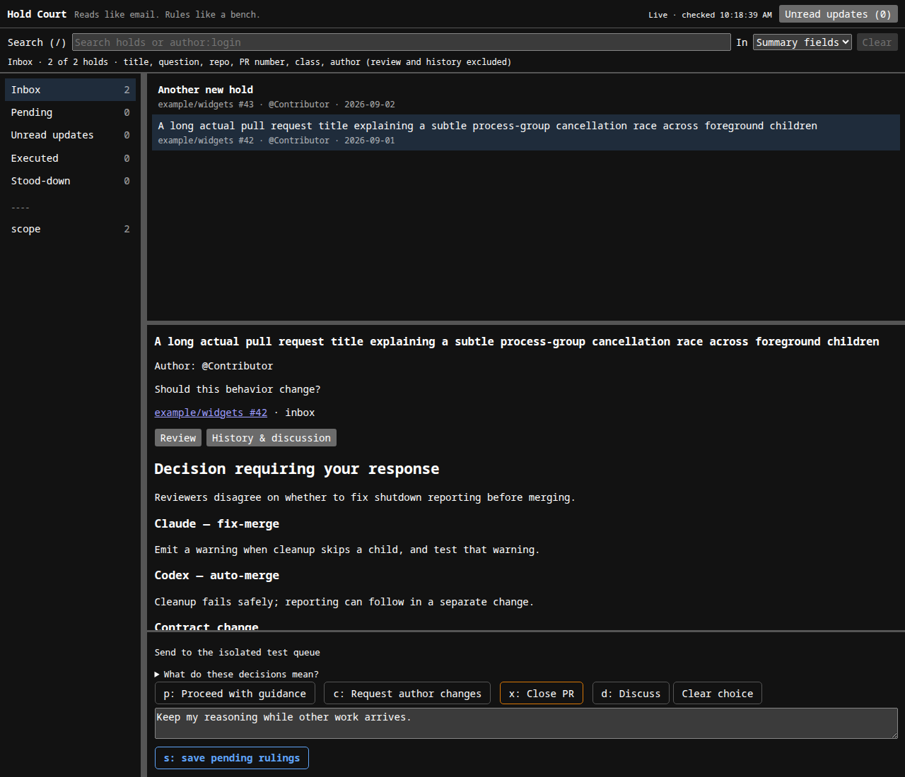
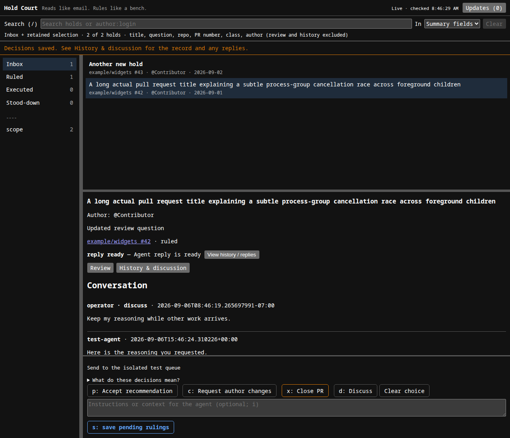
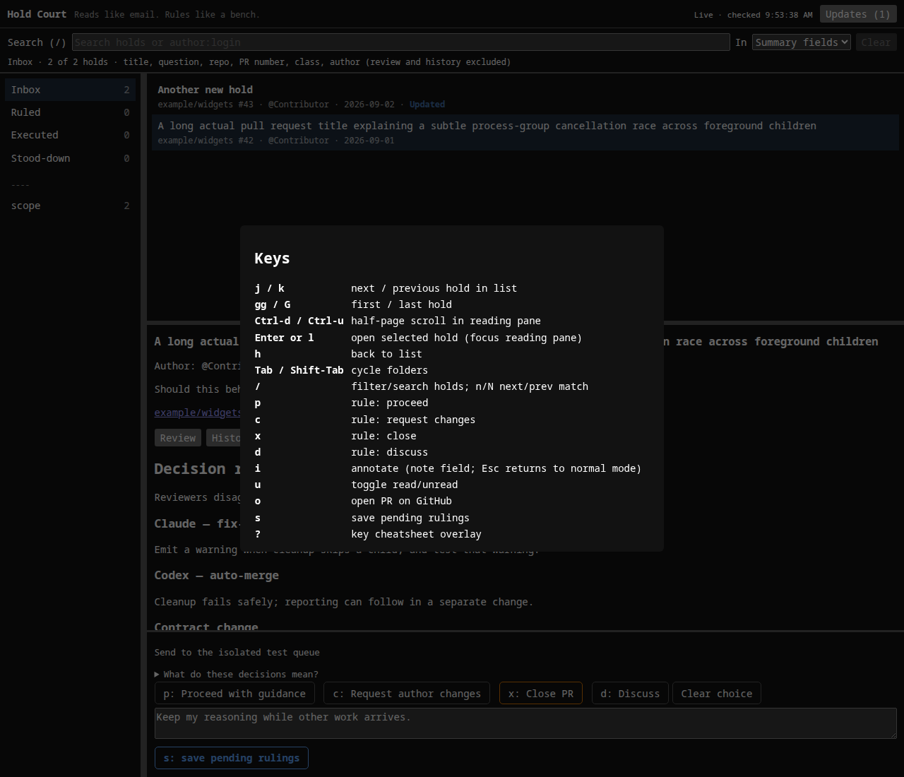

# Hold Court

[](https://github.com/quad341/hold-court/actions/workflows/ci.yml) [](go.mod) [](https://pkg.go.dev/github.com/quad341/hold-court) [](LICENSE)

A decision bench for maintainers. When an automated review pipeline holds a PR
for a human — an ambiguity worth a ruling, a policy call, a guard nobody should
relax silently — those holds pile up in mail nobody reads. Hold Court turns
them into something you can actually work: an inbox of holds, each reduced to
the one question it actually asks, with the prepared review alongside and a
ruling a keypress away.

Reads like email. Rules like a bench.

**Status: early.** Being built in the open; the design is in
[DESIGN.md](DESIGN.md). Companion to
[maintainer-pr-review](https://github.com/quad341/maintainer-pr-review), whose
hold queue is the first feed source — but the feed contract is deliberately
tool-agnostic.

## Run locally

Install Go 1.26.6 or newer (see [go.mod](go.mod)) and GNU Make, then run
this from the repository root:

```sh
make run
```

Open the localhost URL printed in the terminal. The server chooses a free
port; stop it with `Ctrl-C`. Go downloads dependencies on the first run.
No configuration file or separate build step is required.

By default, Hold Court reads holds from `./feed`, writes decisions to
`./rulings`, and stores read state in `./hold-court.db`. A missing feed
directory starts an empty inbox. Point it at your pipeline's feed to see
holds; the JSON format is in [the feed contract](DESIGN.md#feed-contract-v0).

Pass server flags through `ARGS`:

```sh
make run ARGS='-feed /path/to/feed -rulings /path/to/rulings -addr 127.0.0.1:8080'
make run ARGS='-help'
```

For persistent feed paths and an optional ruling hook, create
`holdcourt.toml` in the repository root:

```toml
feed = "/path/to/feed"
rulings = "/path/to/rulings"
# on_ruling = ["/path/to/consumer", "--some-option"]
```

Explicit command-line flags override the configuration file. Continue to
launch with `make run`; consumers receive each ruling as JSON on stdin.

## Common tasks

Run `make` or `make help` to list the available commands.

| Command | Task |
| --- | --- |
| `make run` | Start the local web UI |
| `make build` | Build the `./hold-court` binary |
| `make install` | Install the binary into `GOBIN`, or `GOPATH/bin` by default |
| `make test` | Run all Go tests |
| `make test-race` | Run tests with the race detector |
| `make vet` | Run Go's static checks |
| `make fmt` | Format Go source |
| `make fmt-check` | Check formatting without modifying source |
| `make tools` | Install the same golangci-lint version used by CI |
| `make lint` | Run golangci-lint |
| `make check` | Build, check formatting, vet, race-test, and lint |
| `make clean` | Remove the built binary; keep feeds, rulings, and database |

For development, run `make tools` once and ensure your Go binary installation
directory (`GOBIN`, or `GOPATH/bin`) is on `PATH`. Then `make check` runs the
checks used by CI. Race tests require cgo enabled and a C compiler; ordinary
builds and `make test` do not require cgo. You can override tool commands with
`GO` and `GOLANGCI_LINT`, for example `make lint GOLANGCI_LINT=/path/to/golangci-lint`.

## Screenshots

Three panes, mutt-shaped: folders by state and class on the left, the hold list in the middle, the reading pane with the one question, the prepared review, and the ruling bar on the right.



Open a hold with `Enter`, rule with `p` / `c` / `x` / `d`, annotate with `i`, save with `s`.



`?` shows the key cheatsheet.



Synthetic feed data; shown in light theme. Dark follows your system's `prefers-color-scheme` automatically.

## Shape

- One binary: `make run` starts a local web UI. No daemon ceremony.
- mutt-inspired three-pane UI: folders (hold classes), list (unread bold),
  reading pane (the question, the prepared review, the discussion).
- Keyboard-first: j/k to move, one key to rule, i to annotate.
- Holds arrive via a small JSON feed contract; rulings leave as JSON plus an
  optional on-ruling hook, so any automation (including an AI agent) can
  execute what you decide.
- SQLite for discussion threads and read-state. Pure Go, no cgo — builds for
  macOS and Linux with `make build`.

## License

MIT
